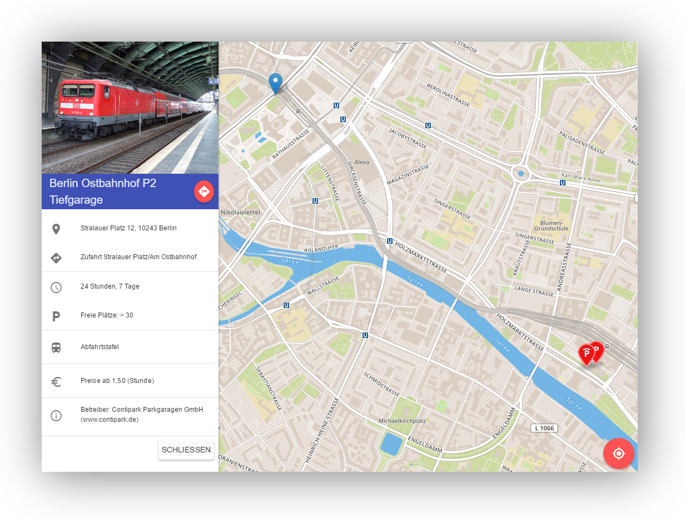

# ParkMe

> ParkMe is a responsive parking space finder based on Node.js, Express and Angular -- [Live-DEMO](http://parkme-db.herokuapp.com/)

## Features

- Find the current user location and show it on a beautiful map
- Find the nearest parking space (Deutsche Bahn Parkraum API)
- Show route and directions to a selected parking space
- Show additional information like free spaces and price
- Show current departures of a selected station (Deutsche Bahn Fahrplan API)
- A Node.js/Express server for both, App and APIs

## Author

- Jan-Henrich Mattfeld

## Prerequisites

Download and install the most recent Node.js LTS release from [https://nodejs.org](https://nodejs.org/).

Make sure `node` and `npm` are in your path and you have installed Bower globally via `npm install -g bower`.

## Installation

1. `npm install` (This loads all third party modules)
2. `bower install` (This loads all third party frontend libraries)

## Folder Overview

* server: contains the server-side code
* client: contains all client-side files that will be served by the web server
* node_modules: contains all third party dependencies

## APIs

ParkMe uses APIs for which you have to register to get an access key:

1. [Deutsche Bahn Fahrplan API](https://data.deutschebahn.com/dataset/api-fahrplan)
2. [MapBox Tiles and Marker](https://www.mapbox.com/studio/signup/?path=%2Faccount%2Ftokens%2F)

## Start Up

* `node .` starts the application
* `npm start` starts the application with nodemon (automatic restart when files are changed)
* `http://localhost:1337` shows the app

## Routes

* `/` serves client/index.html
* `/departures/get?station_id=id` retrieves the departures of a station.

## Troubleshooting

After a pull re-run `npm install` and `bower install` to get new dependencies.
